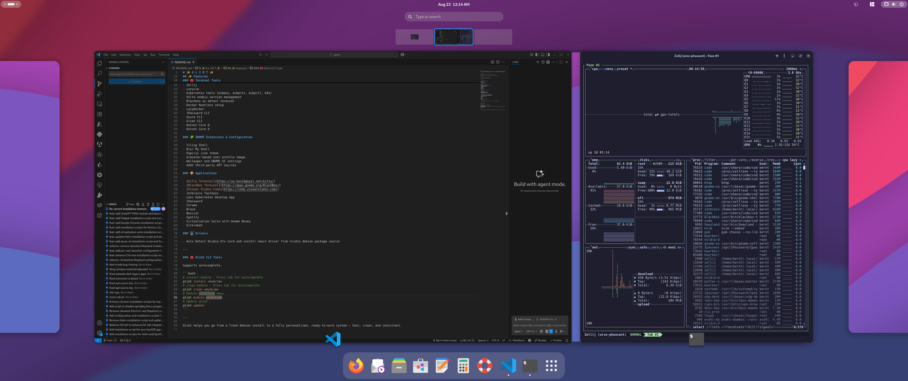

# ✨ G L I M T ✨

**Glimt** is an opinionated post-installation tool for **Debian (Trixie)** and **Fedora**. It streamlines and personalizes your Linux setup—both in the terminal and on the GNOME desktop—by applying sensible defaults, installing essential tools, and delivering a clean, consistent environment that’s ready to use from the start.

---

## 📥 Install

To install Glimt, simply run the following command in your terminal:

```bash
 bash <(wget -qO- https://raw.githubusercontent.com/kenguru33/glimt/main/bootstrap.sh)
```

### ❗ Important

- Do **not** run this script as the `root` user
- Your user **must** have **sudo** privileges

---



---

## ✨ Features

### 💻 Shell environment & Theme

- ZSH setup
- Starship prompt
- Catppuccin color scheme

### 🧰 Terminal Tools

- Git and related essentials
- Zellij
- Lazyvim
- Kubernetes tools (kubens, kubectx, kubectl, k9s)
- Volta nodejs version management
- BlackBox terminal (Debian core, Fedora optional extra)
- Docker Rootless setup
- LazyDocker
- 1Password CLI
- Azure CLI
- Glimt CLI
- .NET 8
- .NET 10
- btop

### 🧩 GNOME Extensions & Configuration

- Tiling Shell
- Blur My Shell
- Papirus icon theme
- Gravatar-based user profile image
- Wallpaper and GNOME UI settings
- Adds third-party APT sources

### 📦 Applications

- [Kitty Terminal](https://sw.kovidgoyal.net/kitty/)
- [BlackBox Terminal](https://apps.gnome.org/BlackBox/)
- [Visual Studio Code](https://code.visualstudio.com/)
- JetBrains Toolbox
- Lens Kubernetes Desktop App
- 1Password
- Chrome
- Discord (Fedora: Flatpak)
- Spotify (Fedora: Flatpak)
- TablePlus
- Virtualization Suite with GNOME Boxes
- GitKraken

### 🖥️ Drivers

- Auto-detect NVIDIA GPU and install the newest driver (Debian)

---

### 🧰 Glimt CLI Tools

Supports autocomplete.

```bash
# install module - Press tab for autocomplete
glimt install <module>
# clean module - Press tab for autocomplete
glimt clean <module>
# Module selection menu
glimt module-selection
# Update glimt
glimt update
```

### 🧠 OS-aware completions

`glimt install <TAB>` and `glimt clean <TAB>` complete modules from the correct tree:

- Fedora/RHEL: `modules/fedora/` and `modules/fedora/extras/`
- Debian/Ubuntu: `modules/debian/` and `modules/debian/extras/`

### 🔐 Fedora note: Git credentials (GNOME Keyring)

On Fedora, Git uses `git-credential-libsecret` (GNOME Keyring). If your user keyring socket isn’t enabled, run:

```bash
systemctl --user enable --now gnome-keyring-daemon.socket
```

---

Glimt helps you go from a fresh install to a fully personalized, ready-to-work system — fast, clean, and consistent.
