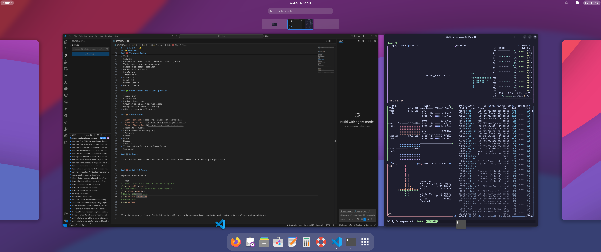

<div align="center">

# Glimt

**One command. Fully configured Fedora.**

Fresh install to dev-ready workstation — shell, desktop, Kubernetes, apps — without lifting a finger.

[](LICENSE)


<br>

```bash
bash <(wget -qO- https://raw.githubusercontent.com/kenguru33/glimt/main/bootstrap.sh)
```

<br>



</div>

---

## Why Glimt?

Setting up a new Fedora install means hours of repetitive work — installing packages, tweaking GNOME, downloading binaries, wiring up dotfiles. Glimt does all of it in one run and gives you a CLI to manage it afterwards.

- **Idempotent** — run it again any time, it picks up where it left off
- **Modular** — every tool is its own script; install or clean individually
- **Pick what you want** — core modules run automatically, extras are opt-in via an interactive picker
- **No root required** — run as your normal user, glimt uses sudo only when needed

---

## What you get

### Shell & terminal

A modern ZSH setup with Starship prompt, Catppuccin Mocha colors, Nerd Fonts, and all the CLI essentials.

| Module | | Module | |
|---|---|---|---|
| `zsh-env` | ZSH + config scaffolding | `bat` | `cat` with syntax highlighting |
| `starship` | Starship prompt | `eza` | Modern `ls` replacement |
| `fzf` | Fuzzy finder | `btop` | Resource monitor |
| `wl-copy` | Wayland `pbcopy`/`pbpaste` | | |

### Development tools

Git with GNOME Keyring, Neovim + LazyVim, and Node.js version management out of the box.

| Module | | Module | |
|---|---|---|---|
| `git-config` | Git + Keyring credentials | `lazyvim` | LazyVim config |
| `nvim` | Neovim | `volta` | Node.js version manager |

### Kubernetes & cloud

Everything you need to work with clusters from day one.

| Module | | Module | |
|---|---|---|---|
| `kubectl` | kubectl | `helm` | Helm |
| `kubectx` | kubens / kubectx | `k9s` | k9s TUI |
| `azure-cli` | Azure CLI | | |

### GNOME desktop

Tiling, blur effects, Catppuccin terminal, Papirus icons, and your Gravatar as your user avatar.

| Module | | Module | |
|---|---|---|---|
| `gnome-config` | Wallpaper, UI, keybindings | `nerdfonts` | Nerd Fonts |
| `gnome-extensions` | Tiling Shell, Blur My Shell, GSConnect, AppIndicator | `papirus-icon-theme` | Papirus icons |
| `ptyxis-theme` | Catppuccin Mocha for Ptyxis | `set-user-avatar` | Gravatar user avatar |

### System

| Module | | Module | |
|---|---|---|---|
| `flatpak` | Flatpak + Flathub | `snapper` | Btrfs snapshots + dnf hooks |
| `chrome` | Google Chrome | `norwegian-mac-keyboard` | Norwegian Mac layout |

---

## Extras — pick what you need

Optional modules are selected through an interactive picker during setup. Add or remove them any time with `glimt module-selection`.

<details>
<summary><strong>Applications</strong></summary>

| Module | Installs |
|---|---|
| `1password` | 1Password |
| `1password-cli` | 1Password CLI (`op`) |
| `discord` | Discord (Flatpak) |
| `spotify` | Spotify (Flatpak) |
| `gitkraken` | GitKraken |
| `tableplus` | TablePlus |
| `pika-backup` | Pika Backup |

</details>

<details>
<summary><strong>Chrome PWAs</strong></summary>

| Module | Installs |
|---|---|
| `notion-chrome` | Notion |
| `outlook-pwa` | Outlook |
| `teams-pwa` | Microsoft Teams |
| `chatgpt-pwa` | ChatGPT |
| `ytmusic-pwa` | YouTube Music |

</details>

<details>
<summary><strong>Dev & infra</strong></summary>

| Module | Installs |
|---|---|
| `vscode` | Visual Studio Code |
| `jetbrains-toolbox` | JetBrains Toolbox |
| `dotnet-userspace` | .NET SDK 8 + 10 (userspace, no sudo) |
| `docker-rootless` | Docker rootless mode |
| `lazydocker` | LazyDocker TUI |
| `lens` | Lens Kubernetes desktop |
| `zellij` | Zellij terminal multiplexer |
| `kitty` | Kitty terminal |
| `blackbox-terminal` | BlackBox terminal |

</details>

---

## Glimt CLI

After setup, `glimt` is installed to `~/.local/bin/glimt` with full tab completion.

```bash
glimt install <module>      # install or reinstall a module
glimt clean <module>        # remove a module cleanly
glimt module-selection      # interactive extras picker
glimt update                # pull latest and re-run
```

---

## Notes

**Git credentials** — configured to use `git-credential-libsecret` (GNOME Keyring). Enable the socket if needed:

```bash
systemctl --user enable --now gnome-keyring-daemon.socket
```
